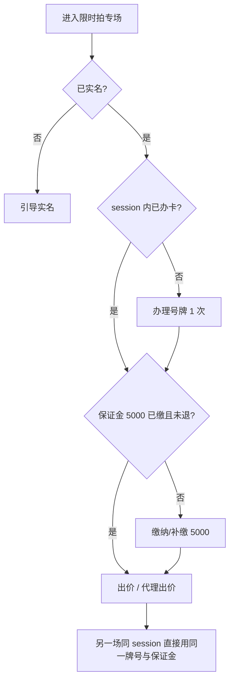
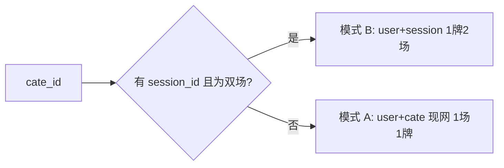

# 限时拍双场并行 · 号牌通用 · 最终方案需求

> **状态：** 已定稿（评审 / 开发对照用）  
> **适用范围：** 限时拍（`store_category.model = 0`）  
> **关联：** [竞价与代理出价改动说明.md](./竞价与代理出价改动说明.md)（出价后即时 `automatic()`，改造时保持）  
> **详细演进记录：** [号牌通用与双场拍卖需求说明.md](./号牌通用与双场拍卖需求说明.md)

---

## 1. 背景与目标

### 1.1 背景

现网限时拍为 **1 个专场 ↔ 1 枚号牌**（`user_id + cate_id`），列表同时只展示 1 场；号牌与保证金混在同一张表。业务需要：

- 同一活动 **前后两天** 内最多 **2 场限时拍** 并行；
- 该周期内 **1 枚号牌通用两场**；
- **保证金固定 5000 元**，与号牌独立管理；
- 两场可同时 **代理出价**；
- **现网单场逻辑必须继续可用**（旧专场、未配置双场 session 的活动不受影响）。

### 1.2 目标

| 目标 | 说明 |
|------|------|
| 双场并行 | 同一 `auction_session` 内最多 2 场限时拍同时预展/进行中 |
| 周期内一牌两场 | 双场 session 内办 1 次牌，两场共用同一 4 位号牌 |
| 保证金 5000 | 限时拍仅 5000 元一档；不足须缴；缴满未退可继续拍 |
| 号牌保证金独立 | 办卡、缴保证金分开；参拍需两者都满足 |
| 同时代理 | 两场多个 Lot 可同时设代理、跟价互不阻塞 |
| 兼容现网 | 无 session / 单专场仍 **1 场 1 牌**；下一期仍 **新号牌** |

### 1.3 不在范围

- 同步拍（`model = 1`）的 10 万、1:5 比例、`remaining` 额度体系 **不改**
- 限时拍 **不设** `remaining` 可出价额度池

---

## 2. 核心业务规则

### 2.1 拍卖周期（前后两天）

```
auction_session（连续 2 个自然日）
├── 限时拍专场 A（cate_id）
├── 限时拍专场 B（cate_id）   ← 最多 2 场，绑定同一 session_id
├── 号牌：session 内 1 枚，两场均用
└── 保证金：用户级 5000，两场共用；未退可跨 session 继续拍
```

| 项 | 规则 |
|----|------|
| 周期 | `start_date`～`end_date`，**连续 2 自然日** |
| 专场数 | 每 session **最多 2 个** `model=0` 专场 |
| 下一期 | **新 session** → **重新办卡、新号牌**（与现网「下一期新牌」一致） |

### 2.2 号牌

#### 模式 A — 现网（保留，必须可用）

| 项 | 规则 |
|----|------|
| 适用 | 未配置 `session_id` 的专场、历史数据、单场活动 |
| 关系 | **1 个限时拍专场（cate_id）= 1 枚号牌** |
| 数据 | `user_id + cate_id` |
| 下一期 | 新 `cate_id` → 用户再办卡 → **新号牌** |

#### 模式 B — 双场周期（新增）

| 项 | 规则 |
|----|------|
| 适用 | 后台将 2 场限时拍绑定同一 `auction_session` |
| 关系 | **1 个 session = 1 枚号牌**，两 `cate_id` 共用 |
| 数据 | `user_id + session_id` |
| 第二场 | 不再出现「办理号牌」 |
| 下一期 | 新 session → **重新办卡** → 新号牌 |

#### 接口分支

```text
numberPlate/add、details(cate_id)
  → 查 cate.session_id
  → 有有效双场 session：模式 B（按 session 判重/查牌）
  → 否则：模式 A（按 cate_id，与现网相同）
```

### 2.3 保证金（仅限时拍）

| 项 | 规则 |
|----|------|
| 金额 | **固定 5000 元**，无 1 万、无 1:5、无追加档位、无超额缴纳 |
| 与号牌 | **独立**：办卡不缴保证金；缴保证金不自动办卡 |
| 足额 | `paid_total = 5000` 且 `paystatus = 1`（未退款） |
| 不足 | 未缴 / 未缴满 / 已退款 → **不能出价、不能设代理**，引导缴纳 |
| 正常出价 | **不扣减** 5000 本金 |
| 周期结束 | **不自动作废**；5000 **仍在** → **可继续拍**（含下一 session） |
| 退款 | 用户主动申请，专场结束等条件满足后退 **5000**；**退款后**须再缴 5000 |
| 违约 | 扣至 &lt; 5000 → 须再缴满 5000 |

**参拍资格（限时拍）：**

```text
可出价/代理 = has_plate（当前模式下已办卡） AND deposit_sufficient
deposit_sufficient = (paid_total == 5000) AND (paystatus == 1)
```

### 2.4 代理出价

- 限时拍 `model=0`：设置代理前校验 **号牌 + 保证金**
- 专场 A、B 的多个 Lot **可同时** 设代理
- `automatic()` 覆盖两场；手动出价成功后即时触发（见竞价改动说明）
- **不因** `remaining` 拦截（限时拍无额度池）

### 2.5 规则对照总表

| 维度 | 现网（模式 A） | 双场 session（模式 B） | 同步拍 |
|------|----------------|------------------------|--------|
| 专场↔号牌 | 1 场 1 牌 | 1 session 1 牌 2 场 | 不改 |
| 下一期号牌 | 新 cate → 新牌 | 新 session → 新牌 | 不改 |
| 保证金 | 5000（改造后独立表） | 5000，用户级共用 | 10w/1:5 等 |
| 出价额度 | 无 remaining | 无 remaining | remaining 保留 |
| 同时多场 | 1 场 | 最多 2 场 | 不改 |

---

## 3. 数据方案

### 3.1 新增 `auction_session`

| 字段 | 说明 |
|------|------|
| `id` | 主键 |
| `start_date` / `end_date` | 前后两天（2 自然日） |
| `cate_ids` | 最多 2 个限时拍 `cate_id` |
| `status` | 未开始 / 进行中 / 已结束 |

`store_category` 增加 `session_id`（可空；空则走模式 A）。

### 3.2 号牌

- **模式 A：** 沿用 `store_number_plate`（`user_id + cate_id`）
- **模式 B：** 同表或新表，`user_id + session_id` 唯一；4 位数字 **session 内**不重复
- 缓存：A → `Plates_{uid}{cate_id}`；B → `Plate_{uid}_{session_id}`
- 历史数据 **只读保留**，不合并

### 3.3 保证金（限时拍用户账户）

| 字段 | 说明 |
|------|------|
| `uid` | 用户 |
| `paid_total` | 实缴，足额 **5000** |
| `paystatus` | 0 未缴满 / 1 已缴满 / 2 已退 |
| `out_trade_no` | 微信订单号 |

支付回调 **只写保证金表**，**不写号牌表** `state/paystatus`。

### 3.4 资格查询 API（建议）

`GET numberPlate/details/:cate_id` 扩展返回：

```json
{
  "number_plate": "1234",
  "has_plate": true,
  "plate_mode": "session",
  "paid_total": 5000,
  "deposit_sufficient": true,
  "need_pay": 0
}
```

---

## 4. 改造清单

### 4.1 后端（`mtpm.billionwz.com`）

| 模块 | 改动 |
|------|------|
| 专场列表 | `getALlByIndex` / `getcatlist`：limit **1→2**；清理 `category[0]` 硬编码 |
| 号牌 | `StoreNumberPlateServices`：session / cate_id 双模式 |
| 保证金 | `PayController` / `NotifyController`：限时拍 **仅 5000**；与号牌解耦 |
| 退款 | `refund`：退款后 `paystatus=2`；**未退不因周期结束禁止出价** |
| 出价 | `addPrice`：校验 `has_plate && deposit_sufficient` |
| 代理 | `StoreAgentPriceServices`（`model=0`）、`automatic()`：同上；支持双场 |
| WebSocket / 定时任务 | 双场推送与代理扫描 |

### 4.2 小程序（`mtpm/`）

| 页面 | 改动 |
|------|------|
| `goods_cate1.vue` / `goods_cate2.vue` | 号牌、保证金 **分按钮**；仅「缴纳保证金 5000」 |
| `plate/index.vue` | 双场 session 展示 1 牌 + 关联专场 |
| `user/index.vue` | 保证金 5000 展示与退款 |

### 4.3 明确不改

- `synchronous_*` 页面与 `synchronousAddPrice` / `synchronousAutomatic`
- `StoreAgentPriceServices` 中 `model==1` 的 `remaining` 逻辑

---

## 5. 验收标准

### 5.1 现网兼容

- [ ] 无 session 的单专场：**1 场 1 牌**，与改造前一致  
- [ ] 专场 A 结拍 → 下一期专场 B（新 cate_id）→ 再办卡得 **新号牌**  
- [ ] 历史 `user_id+cate_id` 号牌数据可正常查询  

### 5.2 双场 session

- [ ] 前后 2 天 session 绑定 ≤2 场，列表可见 2 场  
- [ ] session 内办牌 1 次，两场 **同号**  
- [ ] 第二场无「办理号牌」  
- [ ] 新 session → **重新办卡、新号牌**  

### 5.3 保证金

- [ ] 限时拍 **仅 5000**；wxpay 拒绝非 5000  
- [ ] 未缴满 / 已退 → 不能出价、不能代理  
- [ ] 缴满 5000 未退 → 可拍；出价不扣本金  
- [ ] 周期/session 结束，**5000 未退** → **仍可拍**  
- [ ] 退款成功 → 须再缴 5000  
- [ ] 限时拍无 10w、1:5、追加保证金入口  

### 5.4 代理

- [ ] 两场同时设代理，跟价正常（含出价后即时 `automatic()`）  

### 5.5 同步拍

- [ ] 行为与改造前一致  

---

## 6. 实施阶段

| 阶段 | 交付物 |
|------|--------|
| **P1** | `auction_session` 表 + `cate.session_id`；保证金独立表/字段；资格 API |
| **P2** | 号牌双模式（A/B）；保证金 5000 支付/回调/退款；现网回归 |
| **P3** | 双场列表（limit=2）；清理 `category[0]`；双场代理 |
| **P4** | 管理后台 session 绑定 UI；全量验收 |

---

## 7. 流程示意

### 7.1 用户参拍（双场 session）



### 7.2 模式选择



---

## 8. 一句话总结

**双场限时拍活动（前后两天、最多 2 场）共用 1 枚号牌；保证金固定 5000、与号牌分开、缴满未退可持续参拍；单场/旧活动仍 1 场 1 牌；同步拍不动。**
